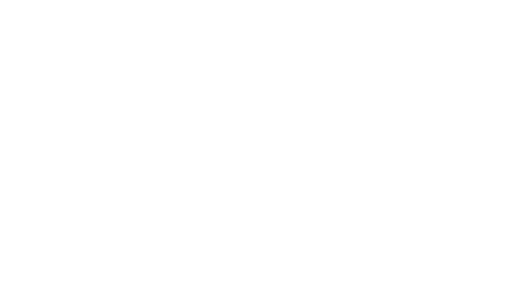

<p align="center">
    
    
</p>

Welcome to the documentation for the Jake programming language.

## Introduction
If one were to think about it, Jake is what you would get if Rust, C, and Haskell had a beautiful baby. Or a bratty one maybe. This baby is highly opinionated, like his second cousin Brisk, though he does operate on a philosophy.

- *Be performant.* All constructs map very closely to WebAssembly, and abstractions are thin.
- *Be maintainable.* Jake will complain when you write code only God could possibly understand.
- *Be real.* Jake will not cater to non-WebAssembly programmers. Bid farewell to booleans, short-circuit evaluation, and traditional control flow semantics. May their bindles serve them well.

## Types

Jake has 5 categories of types.

### Void type

The void type is used to signify either an absence of a value, in the case where it's used in a return value, thus:

```rs
fn main() -> void {
    // returns nothing, function may have side effects
}
```

or an unspecified type, in the case where it's used in a pointer:
```rs
fn main(x: *void) {
    let float = *<*f64>x;
    // or
    let *float = <*f64>x;
}
```

### Stack types

Stack types are the most performant types, and those that you will use in every Jake program you write.

```rs
i32 // a 32-bit signed integer.
u32 // a 32-bit unsigned integer.
f32 // a 32-bit float.
i64 // a 64-bit signed integer.
u64 // a 64-bit unsigned integer.
f64 // a 64-bit float.
isize // a 32 or 64-bit integer.
usize // a 32 or 64-bit integer.
```

> **Note**
> Since unsigned integers are abstractions, conversions of unsigned to signed integers and vice versa are cost-free. They do not require an instruction.

### Heap types

Heap types cannot be used in computation. Instead, they can be used in the following type categories.

```rs
i8 // an 8-bit signed integer.
u8 // an 8-bit unsigned integer.
i16 // a 16-bit signed integer.
u16 // a 16-bit unsigned integer.
```

### Prefix types

Prefix types imbue existing types with new properties. Some you've seen in other languages already.

```rs
&type // an aliased, immutable borrow.
&mut type // a mutable borrow.
&[type] // a fat reference.

// here be dragons 🐉
*type // an immutable raw pointer. 
*mut type // a mutable raw pointer.
*[type] // a fat pointer.
```

Fat pointers are pointers with associated length. That is, it keeps track of the length of the object it's pointing to. It is internally a product type of `[usize, *T or &T]`.

### Infix types

The infix types hold their roots in type theory and category theory.

#### Exponential types

Exponential types are equivalent to the notion of function types in other languages. Jake follows the notion of currying to describe functions with multiple parameters.

```rs
fn foo() -> u32;
// foo has type `void -> u32`

fn bar(x: u32) -> void;
// bar has type `u32 -> void`

fn baz(x: u32, y: i32) -> i64;
// baz has type u32 -> i32 -> i64
```

#### Product types

Product types are the equivalent of structs and tuples present in almost every language.

```rs
type Foo = [u32, u32];

fn main([x, ..]: Foo) {
    // do something with x, the first field
}
```

to declare type destructors, use the `:` type operator.

```rs
type Product = [
    x: u32,
    y: u32
];

fn main() -> u32 {
    let foo: Product = [1, 5];
    return foo.x;
}
```

#### Sum types

Sum types are the equivalent of algebraic enums in Rust, or the disjoint union in general. They are dual to product types, and so are their semantics.

```rs
type Sum = Foo | Bar; // Foo and Bar are type destructors

fn main(Foo) -> *[u8] {
    return "you passed foo";
}

fn main(Bar) -> *[u8] {
    return "you passed bar";
}
```

Sum types may also contain values.

```rs
type Option = Some: u32 | None;

fn main(x: Some) -> u32 {
    return x;
}

fn main(None) -> u32 {
    return 0;
}
```

> **Warning**
> Sum types are the thickest abstraction of Jake's. Use them sparingly.

> **Note**
> Sum types without values are always defined internally as `usize`
> If they have values, then it's `[usize, *mut T]`.

#### Union type 🐉

Union types are unsafe, in that a single memory area is designated several types at once.

```rs
type Unsafe = union [float: f64, int: i64];

fn main(n: i64) -> f64 {
    let beware = union [ int: n ];
    return beware.float; // will reinterpret `n` from i64 to f64
}
```

## Methods

Methods are simply functions. Furthermore, all functions (and consequently methods) are public to discourage code duplication.

```rs
fn double(x: u32) -> u32 {
    return x * 2;
}

fn main() -> u32 {
    return 5.double();
}
```

## Control flow

Much like WebAssembly, there are only two control flow constructs.

### If

`if` functions like any other language, excluding the borrowed `if let` from Rust. Pattern matching and function overloading are encouraged as a primary alternative to `if let`.

```rs
type Option = Some: u32 | None;

fn main(x: Option) -> u32 {
    if let num: Some = x {
        return num;
    } else {
        return 0;
    }
}
```
is the same as
```rs
type Option = Some: u32 | None;

fn main(num: Some) -> u32 {
    return num;
}

fn main(num: None) -> u32 {
    return 0;
}
```

### Loop

Loop is inverted, unlike other languages. That is, a `continue` keyword must be added to keep the loop going.

```rs
fn factorial(n: 0) -> u32 {
    return 1;
}

fn factorial(mut n: u32) -> u32 {
    let mut num: u32 = 0;
    loop {
        num *= n;
        n -= 1;
        continue if n > 0;
    }
    return num;
}
```

```rs
fn fib(n: 0) -> u32 {
    return 0;
}

fn fib(n: u32) -> u32 {
    let mut a = 0;
    let mut b = 1;

    loop {
        n -= 1;

        let t = a + b;
        a = b;
        b = t;

        continue if n > 0;
    }

    return b;
}
```

### Inline functions

Inline functions are always inlined into their call sites as WebAssembly blocks. Consequently, they allow for easy abstraction and flexibility within your code.

```rs
type Option = Some: u32 | None;

inline fn calculate(n: u32, d: 0) -> u32 {
    return None; // returns in the function above this one
}

inline fn calculate(n: u32, d: u32) -> u32 {
    break n / d; // returns the result to the caller
}

// main will return None
fn main() -> Option {
    calculate(5, 0);
}
```

TODO: advanced usage


## Booleans

Jake despises booleans. What a waste of space! Instead, you should use bit operators with integers.

```rs
fn is_pleasant(is_happy: u32, is_cool: u32) -> u32 {
    return is_happy & is_cool;
}
```

Short-circuit evaluation is not provided.

```rs
fn main() {
    let true = 1;
    return true & side_effects(); // will call side_effects!
}
```

### `~` vs `!`

Conventionally, `~` is the operator that inverts all the bits in an integer. WebAssembly does not offer this functionality with one instruction, so `~` is implemented as `x ^ -1`. However, `!` is the equivalent of `x == 0`, and is implemented with a single instruction: `eqz`.

## Memory management

Jake uses Rust's ownership and borrow checking scheme. Thus, he does not use a garbage collector and his ways can be mastered with some practice.

### Lifetimes

Jake doesn't like explicit lifetimes, so he simply infers all of them. This requires an intuition to understand certain errors caused by lifetime elision.

```rs
type Foo = [x: &u32, y: &u32];

fn main() {
    let x = 0; // 'a

    fn inner() -> &u32 {
        let y = 1; // 'b
        let foo: Foo = [&x, &y]; // allowed, internal lifetimes are ['a, 'b]
        return foo.x;
    }

    assert(x == *inner());
}
```

```rs
fn foo(x: &u32, y: &u32) -> &u32 { // x: 'a, y: 'a, return: 'a
    if random() {
        return x;
    } else {
        return y;
    }
}

fn bar(x: &u32) -> &u32 {
    let y = 42; // 'b
    let borrow = foo(&x, &y); // the higher lifetime is coerced to the lower one (&x: 'a -> &x: 'b)
    return borrow; // error, cannot return a pointer whose lifetime will end
}

fn main() {
    let x = 1; // 'a
    let z: &u32 = bar(&x);
}
```